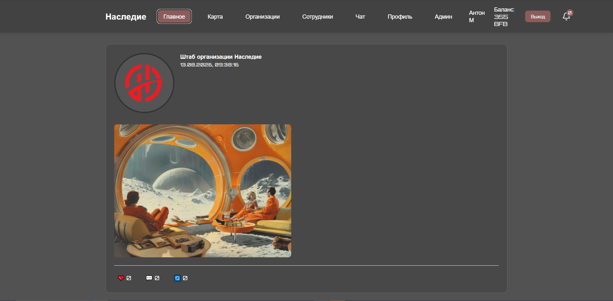
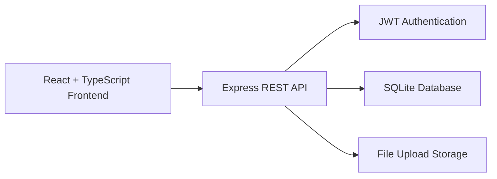

# Nasledie

**Full-stack social network built with React, TypeScript and Node.js**

[Русская версия / Russian documentation](README.ru.md)

Nasledie is a collaborative full-stack social networking project with authentication, user profiles, posts, organizations, file uploads, and private and group chats.

I initiated the project and contributed to its frontend and backend development across multiple stages. Other developers also contributed to the codebase when additional development capacity was needed.

The project uses a React + TypeScript frontend, a Node.js/Express REST API, SQLite persistence, and JWT-based authentication.

---

## Screenshot



---

## Highlights

- **Full-stack application** with separate frontend and backend
- **JWT authentication**
- User registration and login
- Editable user profiles and avatars
- Posts with images, likes, and comments
- Organizations / communities with member roles
- Private and group chats
- File and image uploads
- REST API built with Express
- SQLite database
- Deployed and running on a server

---

## My Contribution

I initiated the project and contributed to both frontend and backend development.

The application was developed collaboratively: additional developers worked on the project at different stages, so the repository contains contributions from multiple people.

My GitHub contributions may appear under both **Medvedev-Anton** and **HeyGoAhead**, which are my accounts.

---

## Tech Stack

### Frontend

- React
- TypeScript
- Vite
- React Router
- Axios

### Backend

- Node.js
- Express
- SQLite / better-sqlite3
- JWT
- Multer
- bcryptjs

---

## Architecture



The frontend communicates with the backend through REST API endpoints.

The backend handles authentication, application logic, database access, and uploaded files.

---

## Main Features

### Authentication

- User registration
- Login
- JWT-based protected routes
- Current-user session handling

### User Profiles

Users can:

- edit profile information
- upload an avatar
- manage profile photos
- view other users

### Posts

The application supports:

- feed
- text and image posts
- likes
- comments
- post deletion

### Organizations

Users can create and join organizations.

Organizations support different member roles, including administrators, moderators, and members.

Posts can also be published on behalf of an organization.

### Chats

The application includes:

- private chats
- group chats
- chat participants
- message sending and deletion

### File Uploads

Uploaded images and files are handled by the Node.js backend using Multer.

---

## Project Structure

```text
nasledie/
├── backend/
│   ├── database/          # SQLite initialization and storage
│   ├── middleware/        # Authentication middleware
│   ├── routes/            # REST API routes
│   ├── uploads/           # Runtime uploaded files
│   └── server.js
│
├── frontend/
│   └── src/
│       ├── components/
│       ├── contexts/
│       ├── pages/
│       ├── types.ts
│       └── App.tsx
│
└── package.json
```

---

## Getting Started

### Install dependencies

```bash
npm run install:all
```

### Configure the backend

Create `backend/.env`:

```env
PORT=3001
JWT_SECRET=replace-with-a-secure-secret
UPLOAD_DIR=./uploads
```

### Start development mode

```bash
npm run dev
```

---

## Security & Repository Hygiene

Sensitive and runtime-generated files are excluded from Git, including:

- `.env` files
- SQLite database files
- uploaded user content
- `node_modules`
- production build directories

JWT secrets should always be provided through environment variables in production.

---

## Project Status

Nasledie is a collaborative full-stack project that has been deployed and used on a server.

Development was carried out by multiple contributors at different stages of the project.

---

## Documentation

For the more detailed Russian documentation, including API endpoints and setup instructions, see:

**[README.ru.md](README.ru.md)**
